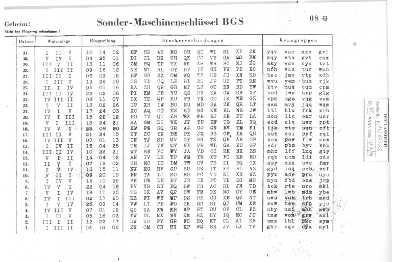

# Projet Enigma
#### Julien, Carolina

## 1ère étape : fonctionnement Enigma
- Qu’est-ce que l’entrée et la sortie de la machine Enigma?
- Comment fonctionne le tableau de connexion ? Combien y’a-t-il de paires de lettre qui sont reliées entre elles ?
- Qu’est-ce qu’un rotor ? Combien y’en a-t-il ? Combien sont utilisé pour chiffrer / déchiffrer les messages ?
- À quoi sert le réflecteur ? Quel était son problème ?

## 2ème étape : création d’une fonction de chiffrement avec Enigma
- Expliquer à quoi correspond Walzenlage, Ringstellung, Stockerverbindungen et Kenngruppen.

## 3ème étape : création d’une fonction chiffrer avec Enigma
#### docs [py-enimga](https://readthedocs.org/projects/py-enigma/downloads/pdf/latest/)
Créer une fonction python chiffrer() qui prend en paramètres les rotors, le réflecteur, disposition des rotors, le tableau de connexion entre les lettre, la clé et le texte en clair. Cette fonction retourne le résultat chiffré.
- Chiffrer le message suivant : « Les troupes britanniques sont entrees a Cuxhaven a quatorze heures le six mai Desormais tout le trafic radio cessera je vous souhaite le meilleur Fermeture pour toujours tout le meilleur au revoir. »

À rendre :
- screenshot du message chiffré dans la documentation

## 4ème étape : création d’une fonction déchiffrer avec Enigma
Créer une fonction python dechiffrer() qui prend en paramètres les rotors, le réflecteur, disposition des rotors, le tableau de connexion entre les lettre, la clé et le texte chiffrer. Cette fonction retourne le texte en claire.

À rendre :
- screenshot du message déchiffré dans la documentation (on devrait avoir le même message)

## 5ème étape : décrypter ce message par bruteforce
Voici le message que vous avez subtilement entendu à la radio :
- HUFLTVDIPVYDQFLDZGEHBNLVVPNCMDTJBSBCISSQAJPWTIMJMRPTOMIKKYKGCJXBNKEQHSUAOMGUJOKLSNABOCSOMYGVLXCJCGVAAYSJFOSISJCAIYFHUJYYJDGGWNCZ

Ce que vous savez :
- Les allemands commencaient toujours le premier message de la journée en annonçant le Wetterbericht soit la météo. Dans ce message ça correspond au mot « meteorologie ».
- La disposition des rotors est la suivante : 19 6 8
- Les lettres sont branchées de la façon suivante : GH QW TZ RO IP AL SJ DK CN YM

Vous allez devoir créer une fonction bruteforce qui va tester toutes les possibilités restantes afin de
tester toutes les combinaisons de rotors différentes (3 parmi les 5) en testant toute les clés possibles
(3 caractères). La seule façon va donc d’être de comparer une partie de l’entrée avec un bout de la
sortie qui est connu. Une fois que vous aurez trouvé les rotors utilisés & la clé vous pourrez déchiffrer
tout le message.

À rendre :
- Combien de possibilités peut-on tester au maximum avec un tel système (détaillez les calculs)
- Quelle est la clé et quels sont les rotors utilisés (screenshot)
- Quel est le message en claire (screenshot)

## 6ème : étape déploiement sur le Raspberry
Déployez votre programme python (fonction chiffrer(), dechiffrer(), bruteforce() avec les tests )sur le Raspberry et vérifier son bon fonctionnement, merci de m’indiquer dans la documentation sur quelle carte SD et où (path) se trouve votre programme.

## Informations sur le rendu
Suite « au progrès » de ce que certain humain appelle « intelligence artificielle », je me réserve le droit d’interroger oralement certains binômes sur le résultat produit. Une note de 1 sera attribuée si votre rendu n’est pas le fruit de votre propre travail.

- Quand : à définir selon l’avancement des binômes.
- Combien : par groupe de 2.
- Quoi : Documentation et informations concernant la carte SD + path du Raspberry.