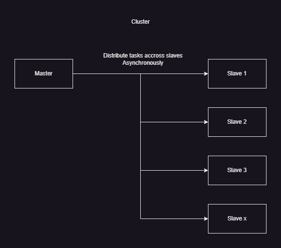

| card number |   hostname   | username | password |
|:-----------:|:------------:|:--------:|:--------:|
|    12.1     | master.local |  master  |  master  |
|    12.2     | slave1.local |  slave1  |  slave1  |
|    12.3     | slave2.local |  slave2  |  slave2  |
|    12.4     | slave3.local |  slave3  |  slave3  |

# Basic cluster understanding

# Q&A

## Tester votre méthode de bruteforce en partageant le job sur les 4 Raspberry et analyser le temps d’exécution

Temps d'execution divisé par 3 (1 master + 3 slaves)

## Que ce passe-t-il si on suppose ne pas connaitre la position des Rotors en plus du Kenngruppen et de quels rotors sont utilisés? Détaillez le calcul de temps

Il y a beaucoup + de possibilités à tester, par consequent cela explose le temps d'execution du bruteforce\
On passe de :\
Total Enigma Machine Possibilities: 2'793'925'870'508'516'103'360'000\
à\
Total Enigma Machine Possibilities: 49'106'041'100'057'679'032'655'360'000\
(Calcul de la partie 1 * 26^3)

## Réalisation du cluster

Sur chaque slave :
1. Copier [Dockerfile](slave/Dockerfile) et [setup-slave](slave/setup-slave) sur le slave
2. Executer setup-slave

Sur le master :
1. Copier [master.py](master/master.py), [requirements.txt](master/requirements.txt) et le dossier [enigma_shit](../enigma_shit) sur le master
2. `python -m venv venv`
3. `source venv/bin/activate`
4. `pip install -r requirements.txt`
5. Editer les IPs dans master.py
6. `python master.py`